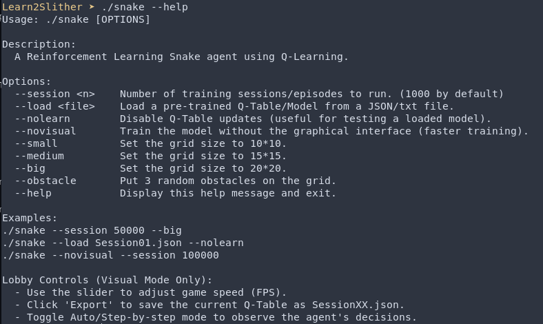

# 🐍 Learn2Slither
A **reinforcement learning** project that trains an AI agent to play the classic **Snake game** using **Q-Learning** implemented from **scratch** in **c++**.


# 🖼️ Overview
### Learning Result
The agent learns to maximize its length through reinforcement learning, improving its policy via experience replay and Q-learning updates. After training for 100,000 sessions, the snake reached a **maximum** length of **65**, with an **average** length of **25**, demonstrating clear learning progress.


### Performance
By leveraging **modern C++** and memory-efficient data structures, Learn2Slither achieves rapid iteration speeds, capable of processing **100,000** training iterations under **20** seconds.


# 🚀 Features
- Cross-Platform Support: Works out of the box on macOS and Linux.
- Smart Build System: A custom Makefile that detects your OS and avoids unnecessary relinking.
- Modern C++: Built using the C++20 standard for robust performance.
- Raylib Integration: Leverages high-performance graphics and input handling.
- Configutable Stimulation:
  - Variable Display Speed: Using a slider to adjust the simulation pace in real-time to observe agent behavior or fast-forward through training.
  - Step-by-Step Mode: Enabled frame-by-frame execution for granular debugging and logic analysis.
  - Dynamic Obstacles: Support for environmental hazards to increase training complexity.

# 🛠️ Prerequisites
Before building, ensure you have the following installed:
## On macOS
- Homebrew
- Raylib: ``brew install raylib``

## On Linux
- G++ (C++20 compatible)
- Raylib: Installed in ``~/raylib_local`` (or update the ``RAYLIB_PATH`` in the Makefile).
- Development Headers: ``X11``, ``OpenGL``, and ``pthread``

# 🏗️ Installation & Build
1. Clone the repository:
```
git clone https://github.com/yourusername/Learn2Slither.git
cd Learn2Slither
```
2. Compile the project:
```
make
```
3. Run the game with possible options:
```
./snake [options]
```

