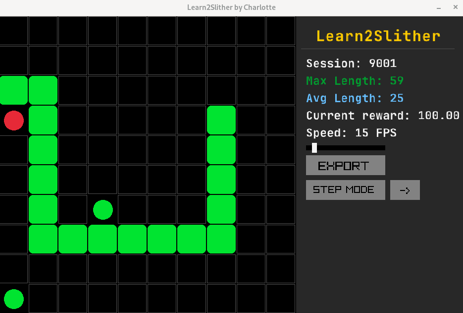
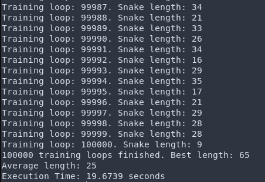

# 🐍 Learn2Slither
A **reinforcement learning** project that trains an AI agent to play the classic **Snake game** using **Q-Learning** implemented from **scratch** in c++.

# 🖼️ Overview
### Learning Result
The agent learns to maximize its length through reinforcement learning, improving its policy via experience replay and Q-learning updates. After training for 100,000 sessions, the snake reached a **maximum** length of **65**, with an **average** length of **25**, demonstrating clear learning progress.

### Performance
By leveraging **modern C++** and memory-efficient data structures, Learn2Slither achieves rapid iteration speeds, capable of processing **100,000** training iterations under 20 seconds.

